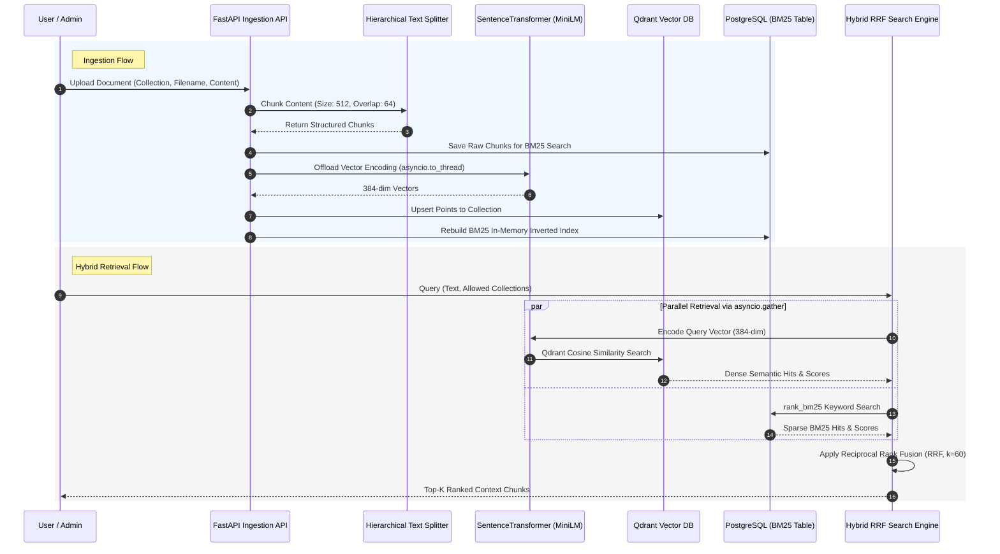
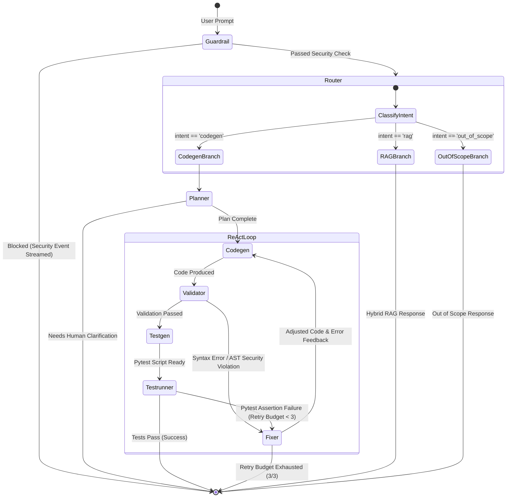
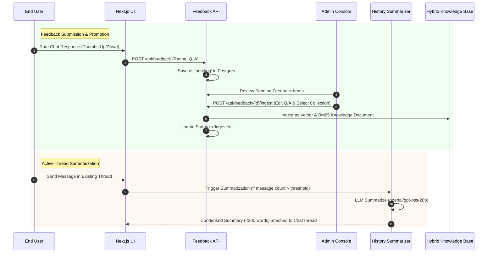
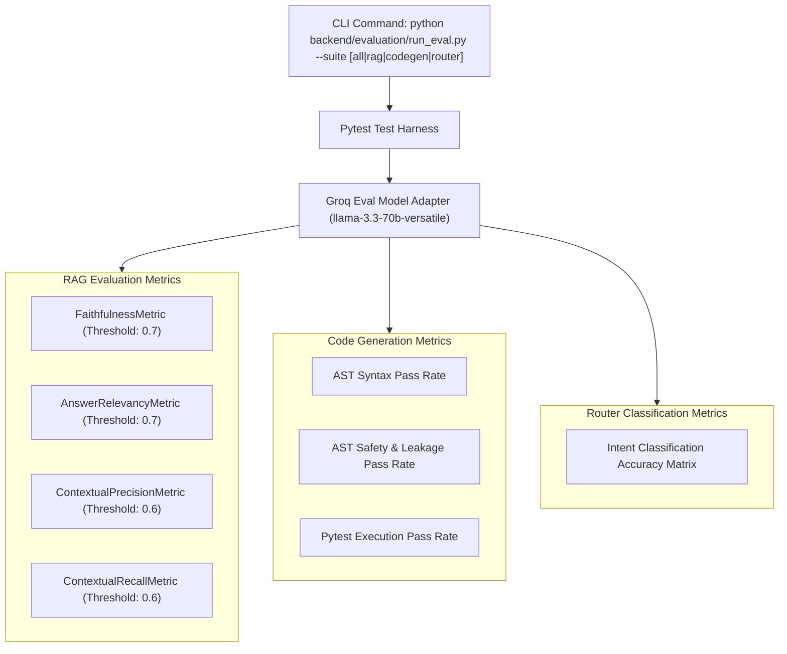

# Cortex System Architecture Specification

## 1. Executive Summary & System Overview

**Cortex** is an enterprise-grade, multi-agent AI platform built to deliver accurate domain knowledge retrieval (Hybrid RAG), secure code generation (ReAct multi-agent execution loop), enterprise multi-tenancy, and continuous security evaluation. 

The architecture is composed of a decoupled FastAPI backend orchestrating a **LangGraph StateGraph**, paired with a Next.js 14 frontend, a dual-engine vector/keyword storage layer (Qdrant + PostgreSQL BM25), and host-isolated sandbox execution.

> [!NOTE]
> All core reasoning agents utilize high-throughput LLM endpoints via Groq API (`openai/gpt-oss-20b` for agent reasoning & planning, `llama-3.3-70b-versatile` for security evaluation and DeepEval judging).

```mermaid
flowchart TB
    subgraph ClientLayer ["Client Layer (Next.js 14 App Router)"]
        UI["React Desktop Dashboard / UI Components"]
        Zustand["Zustand State Store"]
        SSE_Client["SSE Progress Stream Listener"]
    end

    subgraph SecurityLayer ["Security & Ingress Gateway"]
        JWT_RBAC["JWT Authenticator & RBAC Engine"]
        MultiTenant["Tenant ID Isolator (tenant_id)"]
        GuardrailNode["NeMo & Heuristic Guardrail Engine"]
    end

    subgraph OrchestrationLayer ["LangGraph Multi-Agent Engine"]
        RouterNode["Intent Router Node"]
        PlannerNode["Code Planner Node"]
        CodegenNode["Code Generator Node"]
        ValidatorNode["AST & Safety Validator Node"]
        TestgenNode["Pytest Test Generator Node"]
        TestrunnerNode["Sandbox Test Runner Node"]
        FixerNode["Self-Correction Fixer Node"]
        RAGNode["Hybrid RAG Search Node"]
    end

    subgraph SandboxLayer ["Host-Isolated Execution Sandbox"]
        TempWorkspace["Isolated Temp Directory"]
        SecretScrubber["Subprocess Secret Scrubber"]
        PytestEngine["Pytest Execution Subprocess"]
    end

    subgraph DataStorageLayer ["Data & Retrieval Tier"]
        Qdrant["Qdrant Vector DB (Dense Embeddings)"]
        Postgres["PostgreSQL DB (Sparse BM25 & Entities)"]
        SentenceTransformers["MiniLM-L6-v2 Embeddings"]
    end

    UI -->|REST / JWT Header| JWT_RBAC
    JWT_RBAC --> MultiTenant
    MultiTenant --> GuardrailNode
    GuardrailNode -->|Allowed| RouterNode

    RouterNode -->|Intent: codegen| PlannerNode
    PlannerNode --> CodegenNode
    CodegenNode --> ValidatorNode
    ValidatorNode -->|Valid| TestgenNode
    ValidatorNode -->|Syntax / Security Error| FixerNode
    TestgenNode --> TestrunnerNode
    TestrunnerNode -->|Tests Pass| UI
    TestrunnerNode -->|Tests Fail| FixerNode
    FixerNode -->|Retry Loop| CodegenNode

    TestrunnerNode --> SandboxLayer
    TempWorkspace --> SecretScrubber --> PytestEngine

    RouterNode -->|Intent: rag| RAGNode
    RAGNode -->|Parallel Query| SentenceTransformers
    SentenceTransformers --> Qdrant
    RAGNode -->|Sparse Query| Postgres
    RAGNode -->|RRF Ranking| SSE_Client

    OrchestrationLayer -->|Step Events (SSE)| SSE_Client
```

---

## 2. Knowledge Flow Architecture (Hybrid RAG Pipeline)

The Knowledge Pipeline ingests domain documents, processes them via a natural boundary text splitter, generates vector embeddings asynchronously, and performs parallel multi-collection hybrid retrieval combining dense semantic search with sparse keyword search.



### 2.1 Ingestion & Chunking Strategy
- **Hierarchical Splitter (`backend/ingestion/ingest.py`)**: Uses a recursive Markdown/text splitter that respects natural semantic boundaries. Splitting order:
  1. Double Newlines (`\n\n` - Paragraphs)
  2. Section Headers (`\n# `, `\n## `, `\n### `)
  3. Single Newlines (`\n`)
  4. Sentence Ends (`. `, `? `, `! `)
  5. Word Boundaries (` `)
- **Target Chunk Size**: `512` characters.
- **Chunk Overlap**: `64` characters (word-boundary preserved).

### 2.2 Storage & Search Technologies
| Layer | Technology / Model | Role | Configuration / Details |
| :--- | :--- | :--- | :--- |
| **Dense Vector Search** | `Qdrant` | Semantic vector search | Cosine distance metric, 384 dimensions per vector |
| **Sparse Keyword Search** | `PostgreSQL` + `rank_bm25` | Exact term & keyword matching | Custom `Document` entity table indexed per collection |
| **Embedding Engine** | `sentence-transformers/all-MiniLM-L6-v2` | Dense vector embedding generation | Offloaded to background worker threads via `asyncio.to_thread()` |
| **Hybrid Fusion** | Reciprocal Rank Fusion (RRF) | Merging dense + sparse search results | Formula: $RRF(d) = \sum_{m \in M} \frac{1}{k + r_m(d)}$ with constant $k=60$ |

---

## 3. Coding Flow Architecture (ReAct Agent & Sandbox Execution)

The Coding Pipeline follows a **ReAct (Plan $\rightarrow$ Generate $\rightarrow$ Validate $\rightarrow$ Test $\rightarrow$ Fix)** state loop implemented via LangGraph `StateGraph`.



### 3.1 LangGraph Nodes & Model Assignments

| Node | Handler Function | Technology / Model | Primary Function |
| :--- | :--- | :--- | :--- |
| **Guardrail** | `guardrail_check` | Regex + NeMo + `llama-3.3-70b-versatile` | Inspects prompt for injections, system leaks, and overrides. |
| **Router** | `route_intent` | Heuristics + `openai/gpt-oss-20b` | Classifies query intent into `codegen`, `rag`, or `out_of_scope`. |
| **Planner** | `plan_code` | `openai/gpt-oss-20b` | Generates architectural design plan; sets `needs_clarification` if ambiguous. |
| **Codegen** | `generate_code` | `openai/gpt-oss-20b` | Produces pure Python executable script with strict safety/privacy prompts. |
| **Validator** | `validate_code` | AST Parser + `pyflakes` | Performs static analysis, forbidden import/builtin scans, and string literal security checks. |
| **Testgen** | `generate_tests` | `openai/gpt-oss-20b` | Synthesizes comprehensive `pytest` unit test suites. |
| **Testrunner** | `run_tests` | Docker Pytest Runner | Executes unit tests in a fresh locked-down container. |
| **Fixer** | `fix_code` | `openai/gpt-oss-20b` | Formulates code repairs incorporating exact validator/pytest error output. |

### 3.2 Docker-Isolated Execution Sandbox (`backend/sandbox/executor.py`)
To prevent malicious or accidental code execution side-effects on host infrastructure:
1. **Isolated Workspace**: Creates a unique ephemeral directory using `tempfile.TemporaryDirectory()`.
2. **Ephemeral Input Volume**: The generated files are copied through Docker's API into a unique volume, then mounted read-only in the generated-code container. No host source, environment variables, credentials, or Docker socket are passed through.
3. **Container Hardening**: Containers are unnetworked, non-root, read-only, capability-free, `no-new-privileges`, and constrained to 64 PIDs, 256 MB, and 0.5 CPU.
4. **Fail-Closed Timeout**: Workloads are removed after 30 seconds, and Docker unavailability fails the test run rather than falling back to host execution.

---

## 4. Security, Governance & Guardrails Architecture

Cortex enforces multi-layer security spanning authentication, role authorization, tenant data partitioning, multi-tier prompt injection defense, and AST string-literal sanitization.

```mermaid
flowchart LR
    subgraph Layer1 ["Layer 1: Identity & Authorization"]
        JWT["JWT (HS256 Token)"]
        RBAC["RBAC Engine (Admin / Dev / Viewer)"]
        TenantScoping["Tenant Scoping (tenant_id)"]
    end

    subgraph Layer2 ["Layer 2: Prompt Injection Defense"]
        RegexScan["Regex Signature Scanner"]
        NeMoEngine["NeMo Guardrails Engine"]
        LLMEvaluator["LLM Security Evaluator"]
    end

    subgraph Layer3 ["Layer 3: AST Code Security"]
        ASTWalker["AST Syntax Tree Walker"]
        ForbiddenCheck["Forbidden Modules & Builtins"]
        StringSanitizer["System Leak & Profanity Scanner"]
    end

    subgraph Layer4 ["Layer 4: Host Protection"]
        Sandbox["Docker-Isolated Sandbox"]
        SecretScrub["Read-Only Minimal Mount"]
        SIEMLog["Structured JSON Audit Logs"]
    end

    JWT --> RBAC --> TenantScoping
    TenantScoping --> RegexScan --> NeMoEngine --> LLMEvaluator
    LLMEvaluator --> ASTWalker --> ForbiddenCheck --> StringSanitizer
    StringSanitizer --> Sandbox --> SecretScrub --> SIEMLog
```



### 4.1 Authentication & Role-Based Access Control (RBAC)
- **Authentication**: `HS256` signed JWT bearer tokens (`backend/auth/jwt.py`) with configurable expiry (`JWT_EXPIRE_MINUTES=1440`).
- **Role Privileges**:
  - **`viewer`**: Read-only access to chat and retrieval. Expressly prohibited from code generation requests.
  - **`developer`**: Access to RAG search and code generation, scoped to assigned Qdrant collections.
  - **`admin`**: Full platform authority (`*` collection access wildcard), knowledge ingestion, feedback promotion, and security incident review.
- **Multi-Tenancy**: All database entities (`User`, `Document`, `Feedback`, `ChatThread`, `SecurityIncident`) carry a `tenant_id` string for strict data partitioning.

### 4.2 Multi-Tier Prompt Injection Protection (`backend/security/guardrails.py`)
1. **Tier 1: Heuristic Regex Scanner**: Instantly matches 20+ signature patterns targeting DAN mode, system prompt overrides, prompt extraction, and instruction repetition.
2. **Tier 2: NeMo Guardrails Engine**: Executes Colang flow policies (`bot_rails.co`) and YAML rails (`config.yml`).
3. **Tier 3: Asynchronous LLM Evaluator**: Queries `llama-3.3-70b-versatile` via Groq (`await evaluator.ainvoke`) to evaluate ambiguous inputs without blocking the main event loop.
4. **Audit Logging**: Flagged violations persist to PostgreSQL as `SecurityIncident` records and stream structured JSON audit events (`log_audit_event`) for SIEM tools (Splunk, Datadog).

### 4.3 AST Static Code Analysis & Confidentiality Enforcements (`backend/agents/nodes/validator.py`)
- **Forbidden Builtins**: `eval`, `exec`, `compile`, `__import__`
- **Forbidden Calls**: `os.system`, `os.popen`, `os.spawn`, `shutil.rmtree`
- **Forbidden Imports**: `subprocess`, `shutil`, `socket`, `ctypes`, `pickle`, `pty`, `multiprocessing`
- **String-Literal Prompt Leak Detector**: Inspects code constants using AST walking to block scripts that attempt to output or print system instructions or assistant prompts.

---

## 5. Feedback Loop & Knowledge Refinement

The system incorporates an end-to-end feedback loop and context window optimizer to continually improve knowledge accuracy and reduce token overhead.



### 5.1 Feedback Promotion Workflow
1. **User Rating**: Users rate responses with thumbs up (+1) or thumbs down (-1).
2. **Admin Review**: Admins inspect pending feedback items in the Admin Dashboard.
3. **One-Click Promotion**: Admins can edit the Q&A text and promote high-value answers directly into any Qdrant/BM25 collection via `POST /api/feedback/{id}/ingest`.

### 5.2 Thread History Summarization (`backend/agents/summarizer.py`)
- Condenses older conversation turns into structured, bulleted summaries under 300 words using `openai/gpt-oss-20b`.
- Retains technical specifics (CNC tool numbers, G-code coordinates, python signatures) while trimming conversational filler.
- Features automatic rule-based fallback if LLM calls fail.

---

## 6. Evaluation Pipeline Architecture (DeepEval & Groq)

Cortex features an automated evaluation suite leveraging **DeepEval** with Groq as an evaluation judge to systematically measure retrieval and code generation performance.



### 6.1 Evaluation CLI Commands
```bash
# Run all evaluation suites
python backend/evaluation/run_eval.py

# Run specific domain evaluation suite
python backend/evaluation/run_eval.py --suite rag
python backend/evaluation/run_eval.py --suite codegen
python backend/evaluation/run_eval.py --suite router
```

---

## 7. Technology & Model Specification Summary

| Component | Technology / Library | Version / Model | Exact Role & Purpose |
| :--- | :--- | :--- | :--- |
| **Agent Reasoning LLM** | Groq API | `openai/gpt-oss-20b` | Intent Routing, Code Planning, Code Generation, Test Generation, Code Fixing, Thread Summarization |
| **Security & Eval LLM** | Groq API | `llama-3.3-70b-versatile` | LLM Input Guardrails Evaluation & DeepEval Judge Model |
| **Dense Embeddings** | SentenceTransformers | `all-MiniLM-L6-v2` | 384-dimensional vector embeddings for Qdrant storage & semantic search |
| **Orchestration Framework**| LangGraph & LangChain | `langgraph >= 0.0.1` | State machine graph execution, dynamic node routing, retry loops |
| **Backend Framework** | FastAPI | `0.110+` | Asynchronous REST API, Server-Sent Events (SSE) streaming, middleware |
| **Database Engine** | PostgreSQL + asyncpg | `15+` | User entities, chat history, BM25 raw text storage, audit logs, feedback |
| **Vector Database** | Qdrant | `v1.8+` | Distributed dense vector store with cosine similarity matching |
| **Keyword Search** | `rank_bm25` | Custom Python | BM25 sparse keyword indexing & scoring |
| **Static Analysis** | Python AST & Pyflakes | Standard Library / Pyflakes | Syntax validation, security checks, secret leak detection |
| **Evaluation Framework** | DeepEval | `deepeval >= 0.20` | RAG Faithfulness, Relevancy, Precision, Recall metrics calculation |
| **Frontend UI** | Next.js & React | `Next.js 14` (App Router) | Responsive dark-theme dashboard, Zustand state management, Tailwind CSS |
| **Containerization** | Docker & Docker Compose | Containerized | Live-mounted local code environments for hot-reloading backend & frontend |
